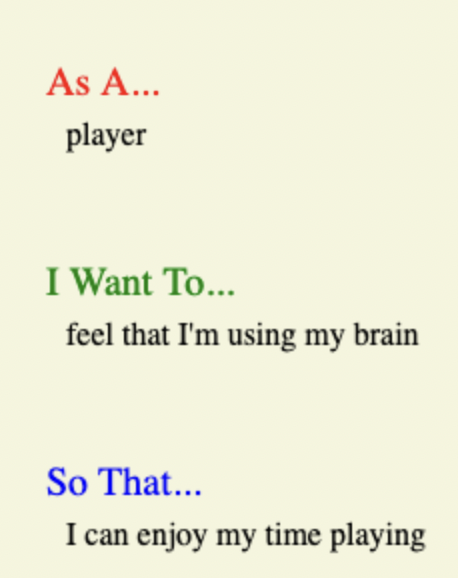
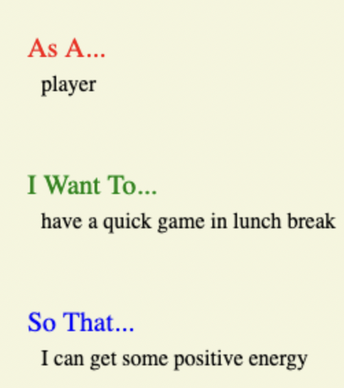
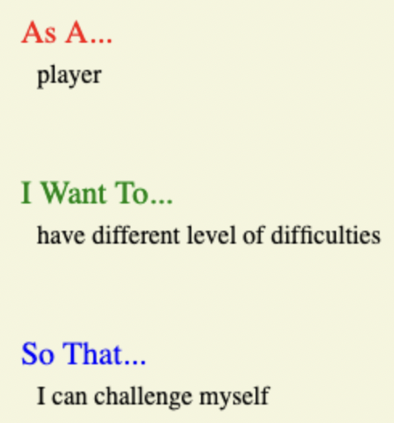
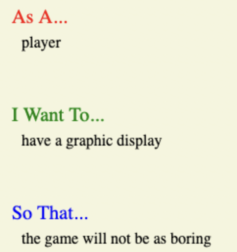

# Hangman

This is a Python remake of Hangman.

[Hangman-by-NP](https:///) - You can play here. 

## Table of contents
1. [**The Game**](#game)
2. [**User Goals**](#user-goals)
3. [**Rules**](#rules)
4. [**Files**](#files)
5. [**How does it look like?**](#game-look)
6. [**How Is It Made?**](#technology)
7. [**If I had unlimited time...**](#to-be-added)
8. [**Testing**](#testing)
9. [**Credits**](#credits)

## **The Game**
The player's goal in the traditional children's game of Hangman is to find a hidden word, for which only the initial letter count is given. Each round, the player guesses an alphabetical letter. If the letter is present in the word, all occurrences are revealed; if not, one of the hangman's body parts is drawn in on a gibbet. If the word is totally disclosed by accurate guesses, the game is won; otherwise, it is lost. If the hangman's body is completely revealed, the game is lost. It is common to keep track of all letters that have been correctly predicted in order to aid the player.

## **User Goals**
I was planning for a game that is
 * easy, fun and quick to play
 * challenging for the player on different levels
 * possible to start over and over again
 * good to look at, even if it's in a terminal window

  
 
 
 

## **Rules**
When the game first begins, each letter of the player's word is represented by an empty field.
Each area that corresponds to a letter gets filled with that letter when the player correctly guesses it.
When a player guesses a letter poorly, a drawing starts to picture itself.
The participant lost the game after making 6 wrong guesses.
Therefore, the gallows should be depicted in 6 distinct states.
Before ten wrong guesses, if every field is filled with its corresponding letter, the player has won the round.

## **Files**

**run.py**

* Allows user to choose a difficulty
* Runs gameplay
* Displays results at the end of the game
* Prompts player to replay the game

**words.txt**

* List of random words to be used in the game.

## **How does it look like?** 

## **How Is It Made?**
Tech used: Python 

 
This Hangman game has been deployed on a Code Institute mock terminal on Heroku.

## **If I had unlimited time...**

If I had more time to improve my program:

* I would enhance the user experience with some styling in HTML/CSS

* I would create a login page, so the players can have their own profile and record their wins/losses, possibly have the option to play against each other online

## **Testing**
Tested each section of the game
1. You can chose difficulty level
*   I have tried inputting a different letter/number, and it is not letting me through, until there is a valid letter, so it is passed the test
2. You have to guess a letter
*   I have tried typing a number, error message is working
*   I have tried typing double letters, error message is working
*   I have tried typing a letter, the game is happening, so this stage is working
3. 
tried incorrect details, double letters, 

## **Credits**

* Random list generator - https://randomwordgenerator.com
* 