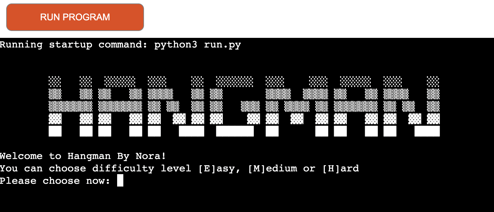

# Hangman

This is a Python remake of Hangman. 
The purpose of the game is just to fill some time when you have 2 minutes to play. 

[Hangman-by-NP](https://hangman-by-np.herokuapp.com/) - You can start playing here. 

## Table of contents
1. [**The Game**](#game)
2. [**User Goals**](#user-goals)
3. [**Rules**](#rules)
4. [**Files**](#files)
5. [**Technology**](#technology)
6. [**Features To Be Added**](#features-to-be-added)
7. [**Features/Testing**](#features/testing)
8. [**Bugs**](#bugs)
8. [**Credits**](#credits)

## **The Game**
The player's goal in the traditional children's game of Hangman is to find a hidden word, for which only the initial letter count is given. Each round, the player guesses an alphabetical letter. If the letter is present in the word, all occurrences are revealed; if not, one of the hangman's body parts is drawn in on a gibbet. If the word is totally disclosed by accurate guesses, the game is won; otherwise, it is lost. If the hangman's body is completely revealed, the game is lost. It is common to keep track of all letters that have been correctly predicted in order to aid the player.

## **User Goals**
I was planning for a game that is
 * easy, fun and quick to play
 * challenging for the player on different levels
 * possible to start over and over again
 * good to look at, even if it's in a terminal window

  
 
 
 

## **Rules**
When the game first begins, each letter of the player's word is represented by an empty field.
Each area that corresponds to a letter gets filled with that letter when the player correctly guesses it.
When a player guesses a letter poorly, a drawing starts to picture itself.
The participant lost the game after making 6/4/2 wrong guesses, based on the level we choose.
Therefore, the gallows should be depicted in 6/4/2 different stages.
Before 6/4/2 wrong guesses, if every field is filled with its corresponding letter, the player has won the round.

## **Files**

**run.py**

* Allows user to choose a difficulty
* Runs gameplay
* Displays results at the end of the game
* Prompts player to replay the game

**words.txt**

* List of random words to be used in the game.

## **Technology**
Tech used: Python 

 
This Hangman game has been deployed on a Code Institute mock terminal on Heroku.

## **Features To Be Added**

If I had more time to improve my program:

* I would enhance the user experience with some styling in HTML/CSS

* I would create a login page, so the players can have their own profile and record their wins/losses, possibly have the option to play against each other online

## **Features/Testing**
Tested each section of the game by features

***Features***

*   Hangman logo to start with for a pleasant user experience
*   There is a possibility to choose from 3 levels: Easy, Medium and Hard
*   While in game, it displays the already guessed letter
*   If a non-alphabetical or double letters been put, there is an error message
*   While guessing, the drawing of the man is constantly showing where we are in the game
*   When lost, a coloured graphic text is advising whether we won or lose - again, coloured text for user experience as well
*   After this, there is a possibility to restart the game, if we say Yes, it start over again, if we say No, it exits the game

***Testing features***

1. You can chose difficulty level
*   I have tried inputting a different letter/number, and it is not letting me through, until there is a valid letter, so it is passed the test

2. You have to guess a letter

*   I have tried typing a number, error message is working
*   I have tried typing double letters, error message is working

*   I have also tried guessing the same letter twice

*   I have tried typing a letter, the game is happening, so this stage is working

3. Once there was a guess of word, the program will decide if it was the correct word or not
*   This stage works as it should as well, I have tested both outcomes

I have also tested the code with [PEP8](http://pep8online.com/), the outcome is as per below

## **Bugs**
1. 
* Problem :lady_beetle: : When we didn't want to play anymore, the game ended with the right text, however it restarted itself still 
* Resolution :white_check_mark: : I had to introduce a sys import and added a sys.exit function

## **Credits**

* [Random list generator](https://randomwordgenerator.com) - to generate words.txt, containing 100 random words
* [Code Institute](https://codeinstitute.net/) for the mock terminal for the deploy to a live site.
* [YouTube Tutorial - Python Hangman](https://www.youtube.com/watch?v=m4nEnsavl6w) - to see how to start off
* [ASCII Colour Codes](https://www.lihaoyi.com/post/BuildyourownCommandLinewithANSIescapecodes.html) - giving me the colour codes that I can use in Python to make text colourful
* [Saltta GitHub](https://github.com/saltta/hangman-game) - for the hangman logo
* [Gibbo GitHub](https://github.com/gibbo101/hangman) - for the hangman graphic itself
* Huge thanks to my mentor, Richard Wells for guiding and helping me through this game build

 